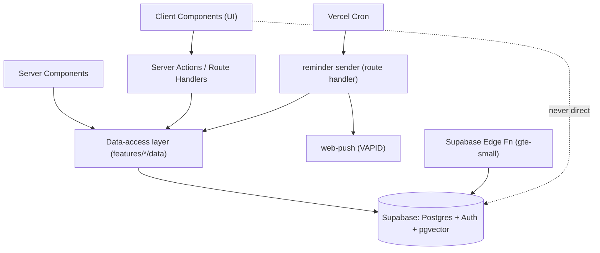
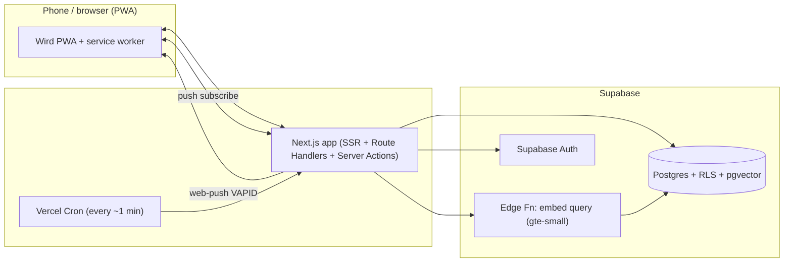
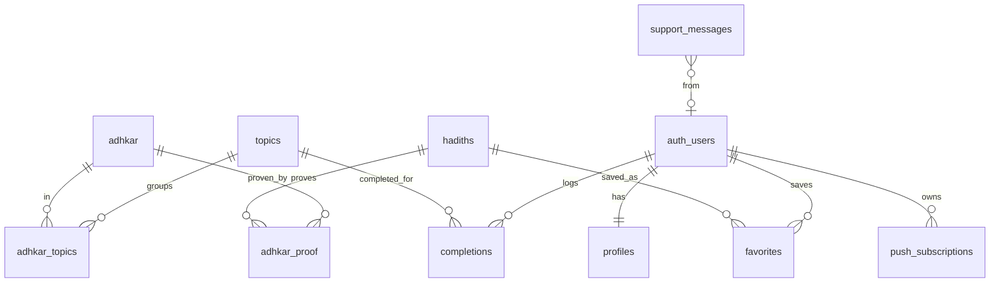

# Architecture Spine — Wird

## Design Paradigm

**Layered, feature-sliced Next.js App Router app over Supabase (BaaS).** Supabase owns persistence, auth, and vector search; Next.js owns UI and the small amount of server logic. Layers map to directories:

- `app/` — routes (App Router). Server Components fetch; Client Components handle interaction. Route Handlers + Server Actions are the only server entry points.
- `features/<feature>/` — feature slices (adhkar, streak, search, reminders, profile, support, auth). Each holds its UI + its data-access functions.
- `lib/` — cross-cutting: Supabase clients (server/browser), i18n, push helpers, types.
- `supabase/` — migrations, seed scripts, Edge Functions (embeddings/search).
- `scripts/` — one-off data seeding (adhkar + hadith import, embedding generation).

## Invariants & Rules



### AD-1 — Supabase is the single source of truth; access only through the data-access layer
- **Binds:** all persistent state (FR-1..18)
- **Prevents:** scattered ad-hoc queries and divergent data shapes across components
- **Rule:** No component queries Supabase inline. All reads/writes go through `features/<feature>/data/*` functions that use the shared Supabase clients in `lib/supabase`. Client Components never hold the service-role key.

### AD-2 — Auth is Supabase Auth; every user-owned row is protected by Row Level Security
- **Binds:** FR-1, FR-2, FR-3, FR-13, FR-14, FR-12, FR-17
- **Prevents:** one user reading/writing another's streak, favorites, profile, subscriptions
- **Rule:** All user-owned tables (`profiles`, `completions`, `favorites`, `push_subscriptions`) have RLS enabled with policies keyed to `auth.uid()`. Protected routes validate the session server-side and redirect to login when absent.

### AD-3 — Streak is DERIVED from completion rows, never stored as a mutable counter
- **Binds:** FR-8, FR-9, FR-10
- **Prevents:** streak drift and double-counting; race conditions on a counter
- **Rule:** Completion is one row per `(user_id, topic_id, completed_date)` with a UNIQUE constraint (idempotent — re-completing the same day is a no-op). Current/longest streak are computed from `completions` on read (SQL or server function), not persisted as editable numbers.

### AD-4 — Content (adhkar + hadith) is read-only seed; retrieval only, never generation
- **Binds:** FR-4, FR-5, FR-7, FR-11
- **Prevents:** fabricated/misattributed religious text; user-mutated canon
- **Rule:** `topics`, `adhkar`, `hadiths`, `adhkar_topics`, `adhkar_proof` are populated only by seed scripts from the sourced datasets. No app code path writes them. Search and proof-display **retrieve** existing rows; there is no LLM-generation path for religious text anywhere.

### AD-5 — One embedding model + dimension, used for BOTH stored vectors and queries
- **Binds:** FR-11
- **Prevents:** query vectors that can't be compared to stored vectors (silent wrong/empty results)
- **Rule:** `gte-small` (384-dim) is the only embedding model. Hadith embeddings are generated with it at seed time; the search query is embedded with the *same* model via the Supabase Edge Function. The `hadiths.embedding` column is `vector(384)` with an HNSW index. Changing the model requires re-embedding all rows.

### AD-6 — UI text lives in message catalogs; content stays Arabic; direction derives from locale
- **Binds:** FR-16 (and all UI)
- **Prevents:** hardcoded strings that can't switch language; broken RTL/LTR
- **Rule:** All interface strings come from `messages/ar.json` + `messages/en.json` via the i18n layer. Adhkar/hadith **content** is always Arabic regardless of UI locale. `dir` (rtl/ltr) is set from the active locale at the layout root, not per-component.

### AD-7 — The reminder sender is the only notifier; notifications are idempotent per day and suppressed when done
- **Binds:** FR-17, FR-18
- **Prevents:** duplicate/spam notifications; notifying a user who already finished
- **Rule:** Push subscriptions are stored per `(user_id, endpoint)`. Only the Vercel-Cron-triggered sender route emits pushes. For each due `(user, routine_topic, day)` it sends at most once and skips any topic already `Day Complete`. The send endpoint is protected by a secret so only Cron can call it.

## Consistency Conventions

| Concern | Convention |
| --- | --- |
| Naming | DB: `snake_case` tables/columns. TS: `camelCase` vars, `PascalCase` components/types. Feature dirs `kebab-case`. |
| IDs | `uuid` primary keys (Postgres `gen_random_uuid()`); auth user id from Supabase `auth.users`. |
| Dates | Timestamps `timestamptz` (UTC). `completions.completed_date` is a `date` in the user's local day (computed client/server-side before insert). |
| Locale/text | UI via i18n catalogs; content Arabic. Language pref stored on `profiles.language`. |
| Errors | Data-layer functions return typed results; route handlers return JSON `{ error }` + proper HTTP status; forms show field-level messages. |
| Secrets | `SUPABASE_SERVICE_ROLE_KEY`, `VAPID_*`, `CRON_SECRET` are server-only env vars; never shipped to the client bundle. |
| Auth check | Server-side `supabase.auth.getUser()` on protected routes/actions; RLS is the backstop. |

## Stack

| Name | Version |
| --- | --- |
| Next.js (App Router, React 19.2, Turbopack) | 16.2.7 |
| TypeScript | 5.x (current stable at scaffold) |
| Supabase (Postgres + Auth + pgvector + Edge Functions) | current cloud (Postgres 15, pgvector ≥0.7) |
| Embedding model | `gte-small` (384-dim, runs in Supabase Edge Function) |
| Serwist (`@serwist/next` + `serwist`) — PWA/service worker | current stable at scaffold |
| web-push (VAPID) | current stable at scaffold |
| next-intl (bilingual i18n) | current stable at scaffold |
| Tailwind CSS (styling) | current stable at scaffold |
| Hosting + scheduler | Vercel (+ Vercel Cron) |

## Structural Seed

**Deployment / topology**


**Core entities**


**Source tree (scaffold)**
```text
wird/
  app/
    [locale]/                 # bilingual routing (ar | en)
      (auth)/login, /signup
      adhkar/[topicSlug]/     # browse topics + dhikr + proof
      search/                 # semantic hadith search
      profile/                # stats + edit + reminder times
      support/                # contact form
      layout.tsx              # sets dir from locale
    api/
      cron/send-reminders/    # Cron-only, secret-guarded
      push/subscribe/
  features/
    auth/ adhkar/ streak/ search/ reminders/ profile/ support/
      # each: components + data/ (Supabase access)
  lib/
    supabase/ (server.ts, browser.ts)  i18n/  push/  types/
  messages/ ar.json  en.json
  supabase/
    migrations/            # tables, RLS, HNSW index, streak fn
    functions/embed/       # gte-small edge function
  scripts/
    seed-adhkar.ts  seed-hadith.ts  embed-hadith.ts
  public/  (manifest, icons)  app/sw.ts (Serwist)
```

## Capability → Architecture Map

| Capability (FR) | Lives in | Governed by |
| --- | --- | --- |
| Auth (FR-1..3) | `features/auth`, Supabase Auth | AD-2 |
| Adhkar by topic + proof (FR-4..7) | `features/adhkar`, `app/[locale]/adhkar` | AD-1, AD-4, AD-6 |
| Daily streak (FR-8..10) | `features/streak`, `completions` + streak SQL fn | AD-3, AD-1 |
| Semantic hadith search (FR-11) + favorites (FR-12) | `features/search`, Edge Fn, `favorites` | AD-4, AD-5, AD-2 |
| Profile (FR-13,14) | `features/profile`, `profiles` | AD-2, AD-6 |
| Support (FR-15) | `features/support`, `support_messages` | AD-1 |
| Bilingual UI (FR-16) | `lib/i18n`, `messages/*`, `app/[locale]` | AD-6 |
| Reminders + push (FR-17,18) | `features/reminders`, `app/api/cron`, `app/api/push` | AD-7, AD-2 |

## Deferred

- **Support delivery channel** (DB-only vs also email) — start DB-only; email is a thin add later.
- **Exact adhkar topic list + dhikr→proof-hadith mapping** — content-prep task; verified during seeding, not an architecture invariant.
- **Streak timezone edge cases** (travel across timezones) — v1 uses the device's local day; refine later.
- **Offline reading** (full PWA offline caching of content) — Serwist enables it; not required for v1.
- **v2 features** — audio adhkar, custom lists, streak-freeze — out of this spine.
